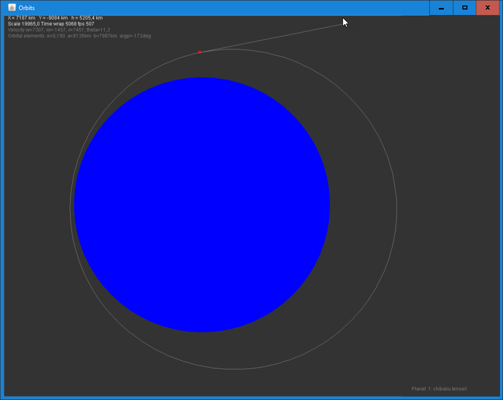

# Orbit Earth

### Launch projectiles from Earth's surface.

The solver uses classical Newtonian mechanics.

# Download 

Get the JAR file under [Actions](https://github.com/haphaeu/OrbitEarth/actions)

# Project Status

